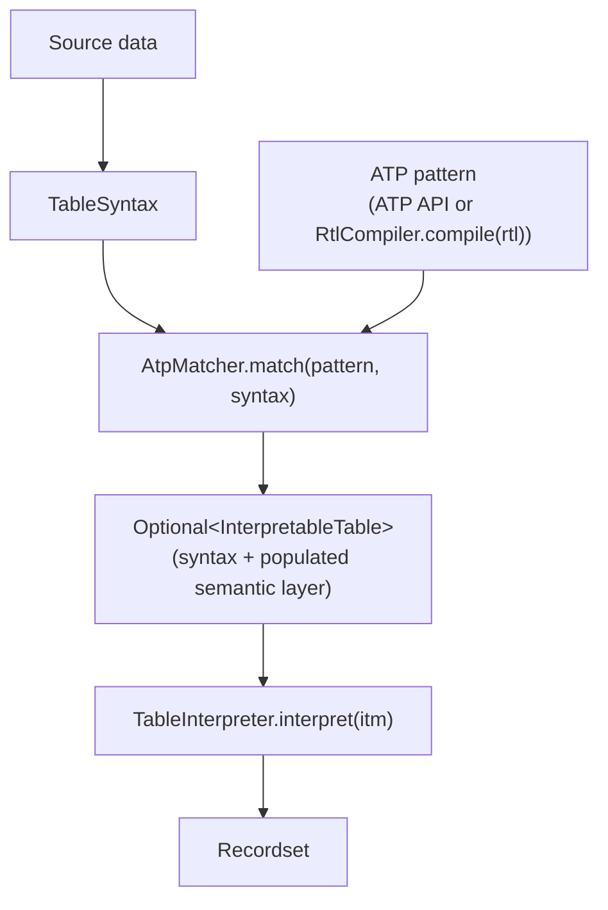
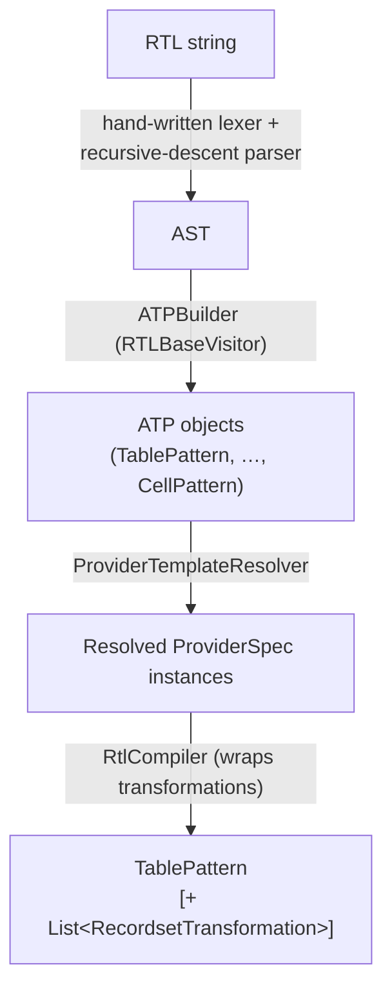
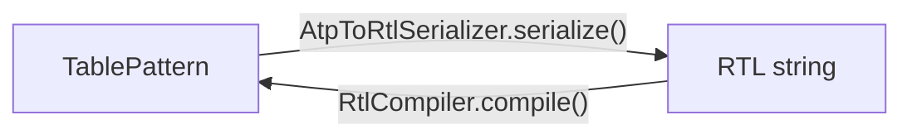

# Architecture

The library is organised around the following components:

| Component | Core module | Description |
|---|---|---|
| **ITM Syntax** | `src/syntax.rs` | Syntactic layer of ITM: `TableSyntax`, `Cell`, `Row`, `Subrow`, `Subtable` |
| **ITM Semantics** | `src/semantics.rs` | Semantic layer of ITM: `TableSemantics`, `CellDerivedItem`, `ContextDerivedItem`, interpretation actions and providers |
| **ATP Spec** | `src/spec.rs` | Formal ATP types: `TablePattern`, `SubtablePattern`, `RowPattern`, `SubrowPattern`, `CellPattern`, content specifications (`AtomicContentSpec`, `DelimitedContentSpec`, `CompoundContentSpec`, `ConditionalContentSpec`), item provider specifications, and interpretation action specifications |
| **ATP Matcher** | `src/matcher.rs` | Matches an ATP instance against an ITM instance; on success populates the semantic layer |
| **RTL Compiler** | `src/rtl/` | Compiles RTL DSL strings to ATP (`RtlCompiler`, hand-written parser following `grammar/RTL.g4`) |
| **ATP→RTL Serializer** | `src/rtl/` | Inverse direction: serializes a `TablePattern` back to an RTL string (`AtpToRtlSerializer`) |
| **Table Interpreter** | `src/interp.rs` | `TableInterpreter` derives a `Recordset` from an `InterpretableTable`; supports configurable `SchemaConstructionStrategy` and post-processing steps (`WhitespaceNormalization`, `FieldSplitting`, `SchemaReordering`) |
| **Recordset** | `src/recordset.rs` | `Recordset`, `Record`, `Schema` |

## Package map

```
ru.icc.regtab (reference layout; pyRegTab mirrors it in src/*.rs)
├── itm/
│   ├── InterpretableTable        — union of syntax + semantics layers
│   ├── syntax/                        — syntactic layer
│   │   ├── TableSyntax           — grid of cells
│   │   ├── Cell                  — cell with position, formatting, text
│   │   ├── Row / Subrow / Subtable
│   │   └── BoundingBox, GridPosition, CellColor, …
│   └── semantics/                     — semantic layer
│       ├── TableSemantics        — items + interpretation actions
│       ├── WorkingState          — mutable state during interpretation
│       ├── action/InterpretationAction
│       ├── item/                      — CellDerivedItem, ContextDerivedItem, ItemType
│       ├── operation/                 — RecOperation, AvpOperation, JoinOperation, FillOperation, PrefixOperation, SuffixOperation
│       ├── predicate/                 — DirectionalModifier, IntRange, …
│       └── provider/                  — ItemProvider, ItemFilter, TraversalOrder, …
├── atp/
│   ├── spec/                          — ATP formal types
│   │   ├── TablePattern / SubtablePattern / RowPattern / SubrowPattern / CellPattern
│   │   ├── ContentSpec (sealed) — AtomicContentSpec, DelimitedContentSpec,
│   │   │                          CompoundContentSpec, ConditionalContentSpec
│   │   ├── ActionSpec             — S_act = (op, ⟨S_prov¹, …⟩)
│   │   ├── ProviderSpec           — S_prov = (k, τ, κ)
│   │   ├── ItemFilterConditionSpec (sealed) — Bare / And / Or / Custom
│   │   ├── FilterTerm (sealed)    — all atomic spatial/content constraints
│   │   └── Quantifier, CellMatchCondition, StringExtractor, …
│   ├── AtpMatcher            — entry point for matching
│   └── match/                     — SyntaxMatcher, SemanticConstructor, MatchResult, …
├── rtl/
│   ├── RtlCompiler           — compiles RTL string → TablePattern
│   ├── AtpToRtlSerializer    — TablePattern → RTL string
│   ├── RtlCompileError
│   └── internal/                  — ATPBuilder, ProviderTemplateResolver, …
├── interpret/
│   ├── TableInterpreter      — 4-phase interpretation
│   ├── SchemaConstructionStrategy — RECORD_FIRST / …
│   ├── ActionApplicationStrategy  — ROW_FIRST / …
│   ├── MissingValueHandler
│   └── RecordsetTransformation    — WhitespaceNormalization, FieldSplitting, SchemaReordering, …
└── recordset/
    ├── Recordset
    ├── Record
    └── Schema
```

---

## Data flow



If the pattern does not match, `AtpMatcher.match` returns `Optional.empty()`.

---

## Interpretation phases

`TableInterpreter.interpret(itm)` executes four phases defined in Section 3.3 of the paper:

| Phase | What happens |
|---|---|
| **1. Initialisation** | Each cell-derived and context-derived item of type VAL/ATTR is entered into the working state with its string value |
| **2. Completion** | Interpretation actions are applied in operation-type order: FILL/PREFIX/SUFFIX → AVP → REC → JOIN; each action uses its providers to retrieve items relative to the anchor and updates the working state |
| **3. Extraction** | The working state is traversed to build the schema (attribute list) and generate records |
| **4. Transformation** | Optional post-processing steps are applied: `WhitespaceNormalization`, `FieldSplitting`, `SchemaReordering` |

---

## RTL compilation pipeline



The grammar lives at `grammar/RTL.g4` and is the **normative
specification of RTL**: alternative implementations (e.g. the pyRegTab hand-written
parser) do not have to generate their parser from it, but must pass the shared
[conformance corpus](https://github.com/regtab/pyregtab/blob/main/conformance/README.md) (`conformance/`), which pairs
every benchmark RTL string with its canonical serialized form and lists inputs that
must be rejected.

Named fragment definitions (`$name=[body]`) in the RTL preamble are resolved during the
`ATPBuilder` pass: each reference expands to a fresh pattern object (syntactic substitution).
Fragments are supported at all four pattern levels: cell, row, subrow, and subtable.

---

## ATP→RTL serialization

`AtpToRtlSerializer.serialize(TablePattern)` is the inverse of `RtlCompiler.compile()`: it traverses a `TablePattern` object graph and produces the corresponding RTL string.



The round-trip property — serialize then compile gives back the original pattern — is verified in `AtpRtlRoundTripTest` for all 50 Foofah benchmark tasks (001–050).

**What is serialized:**

| ATP construct | RTL output |
|---|---|
| `SubtablePattern` with `Quantifier.ONE` and no condition | implicit (no `{ }`) |
| `SubtablePattern` with other quantifier or condition | `{ ... }q` |
| `RowPattern`, `SubrowPattern`, `CellPattern` | `[ ... ]q`, `{ ... }q`, `[ ... ]q` |
| `AtomicContentSpec` with tags | `VAL #'tag'` |
| `AtomicContentSpec` with extractor | `VAL = TRIM` |
| `ActionSpec` (avp, rec, join, fill, prefix, suffix) | `'NAME'->AVP`, `(prov…)->REC`, etc. |
| `ProviderSpec` with traversal order | leading `-` / `^` / `-^` |
| `ProviderSpec` with cardinality | `{n}` / `*` |
| `RecordsetTransformation` settings | `<NORM>`, `<ANCH(n)>`, `<SPLIT("d")>` |

**Limitations:**

- Actions are emitted at the atom level (after `:`). Inherited action specs — those declared at subtable, row, or subrow level and merged down into `AtomicContentSpec.actions()` — are not reconstructed at their original level; they appear as cell-level actions in the output.
- `CellPredicate.custom` and `ItemFilterConditionSpec.custom` throw `UnsupportedOperationException` — only patterns without custom predicates can be serialized.

---

## Native core (pyRegTab)

In pyRegTab the entire pipeline after the Python call boundary is implemented
in Rust and exposed as the extension module `pyregtab._core` (PyO3 + maturin,
one `abi3` wheel per platform):

- the ITM syntactic layer is stored as an arena (flat vectors indexed by
  position) rather than an object graph; the Python `Cell`/`Row`/`Subrow`/
  `Subtable` objects are lightweight handles that keep the table alive;
- the sealed hierarchies of the Java reference implementation (`ContentSpec`, `FilterTerm`, `CellPredicate`,
  `StringExtractor`, …) map to Rust enums;
- the RTL parser is a hand-written lexer + recursive descent structurally
  following `grammar/RTL.g4` (the normative specification, pinned from
  jRegTab); conformance with the reference implementation is enforced by the
  shared corpus in `conformance/`;
- `AtpMatcher.match` and `TableInterpreter.interpret` release the GIL when the
  pattern contains no Python callbacks, so batch workloads can use thread
  pools;
- regular expressions are executed by the Rust `regex` crate (linear-time);
  the reference corpus uses no lookaround/backreferences.
