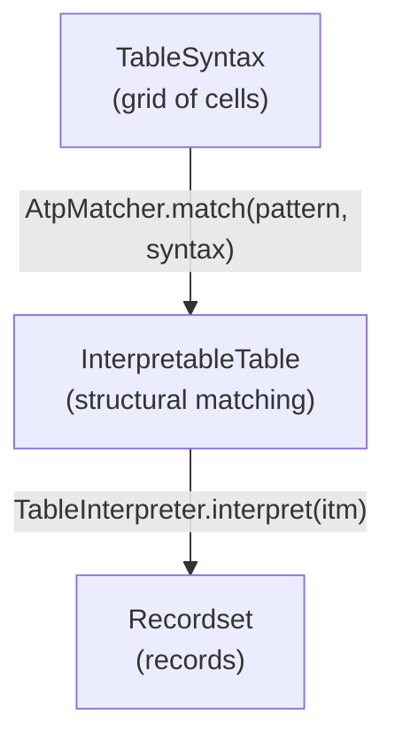

# pyRegTab

**pyRegTab** is an open-source Python library (with a native Rust core) for pattern-driven data extraction from editable document tables.

Tables in spreadsheets, text documents, and web pages are designed for human readability, not machine processing. Cell meaning may depend on position, cells can be compound, headers can be hierarchical, and context may appear outside the table body. **RegTab** addresses this by letting you describe the table's regular structure as a *pattern*; a successful match yields a structured recordset automatically.

---

## How it works



1. **Describe** the table structure as an **ATP** pattern — either in Python (`TablePattern.of(...)`) or as a compact **RTL** string compiled with `RtlCompiler.compile()`.
2. **Match** the pattern against a `TableSyntax` grid with `AtpMatcher.match()`.
3. **Interpret** the result with `TableInterpreter` to get a `Recordset`.

---

## Quick example

Source table — a cross-tabulation of airline departures by airport, with compound `"ND MON"` cells:

```
       | CA     | HU
IKT    | 0 Jan  | 8 Feb
SVO    | 31 Jan | 40 Feb
```

The program below builds this table, compiles an RTL pattern, matches it, and interprets the match
into a flat recordset over the schema `⟨ND, AIRLINE, AIRPORT, MON⟩`:

```python
from pyregtab import TableSyntax, RtlCompiler, AtpMatcher, TableInterpreter

# Build the table shown above
syntax = TableSyntax(3, 3)
syntax.cell(0, 1).set_text("CA");  syntax.cell(0, 2).set_text("HU")
syntax.cell(1, 0).set_text("IKT"); syntax.cell(1, 1).set_text("0 Jan"); syntax.cell(1, 2).set_text("8 Feb")
syntax.cell(2, 0).set_text("SVO"); syntax.cell(2, 1).set_text("31 Jan"); syntax.cell(2, 2).set_text("40 Feb")

# Unpivot into ⟨ND, AIRLINE, AIRPORT, MON⟩; each compound "ND MON" cell is split by space.
pattern = RtlCompiler.compile("""
    [ [] [VAL : 'AIRLINE'->AVP]+ ]
    [ [VAL : 'AIRPORT'->AVP]
      [VAL : (COL, ROW, CL)->REC, 'ND'->AVP " " VAL : 'MON'->AVP]+ ]+
""")

itm = AtpMatcher.match(pattern, syntax)      # InterpretableTable | None
rs = TableInterpreter().interpret(itm)

# rs.schema.attributes  →  ['ND', 'AIRLINE', 'AIRPORT', 'MON']
# rs[0].values()        →  {'ND': '0', 'AIRLINE': 'CA', 'AIRPORT': 'IKT', 'MON': 'Jan'}
```

The resulting recordset `rs`:

```
ND | AIRLINE | AIRPORT | MON
0  | CA      | IKT     | Jan
8  | HU      | IKT     | Feb
31 | CA      | SVO     | Jan
40 | HU      | SVO     | Feb
```

---

## Installation

```
pip install pyregtab
```

Requires **Python 3.10+**; binary wheels for Windows, Linux, and macOS.

---

## Features

- **ITM** (Interpretable Table Model) — formal syntactic and semantic representation of a table: *subtables → rows → subrows → cells*, with value, attribute, and auxiliary items.
- **ATP** (Abstract Table Pattern) — structural + interpretive pattern matching against an ITM instance.
- **RTL** (Regular Table Language) — compact DSL that compiles to ATP; dramatically reduces pattern verbosity.
- **ATP → RTL serializer** — round-trip: serialize any `TablePattern` back to an RTL string.
- **Content specs** — atomic, delimited, compound, and conditional cell content.
- **Action specs** — `REC`, `AVP`, `JOIN`, `FILL`, `PREFIX`, `SUFFIX` for rich schema construction.
- **Named fragments** — reuse recurring sub-patterns in RTL with `$name` definitions.
- **Post-processing** — whitespace normalization, field splitting, schema reordering.
- **150-task benchmark** — Foofah (50), RegTab (60), and Baikal (40) tasks, 1 500 test variants, 100 % pass rate.

---

## Documentation

| Section | Contents |
|---|---|
| [Getting started](getting-started.md) | Installation, first example, full pipeline walkthrough |
| [ITM](model/itm.md) | Syntactic and semantic layers, items, providers, working state, table interpretation |
| [ATP](model/atp.md) | Pattern hierarchy, quantifiers, content specs, action specs, matching |
| [RTL reference](rtl-reference.md) | Complete RTL syntax with tables and examples |
| [Architecture](architecture.md) | Package map, data flow, compilation pipeline |
| [API reference](api.md) | All public classes, factories, and methods |

---

!!! note "Status"
    Current release: **0.3.0** (feature parity with jRegTab 0.4.1) · License: **MIT** · [PyPI](https://pypi.org/project/pyregtab/) · [GitHub](https://github.com/regtab/pyregtab)
